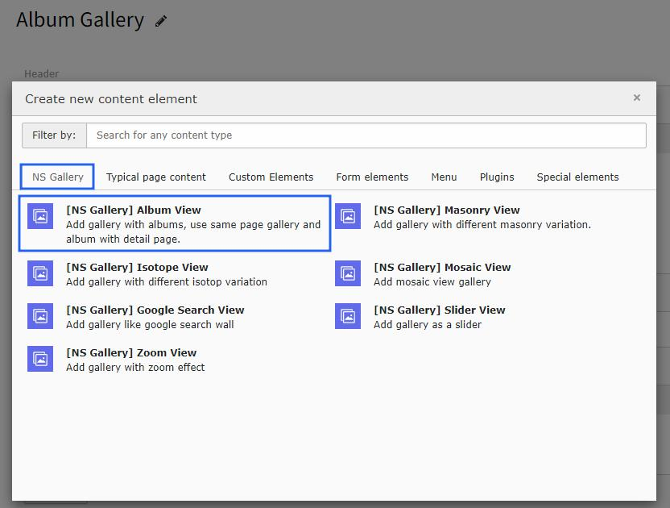
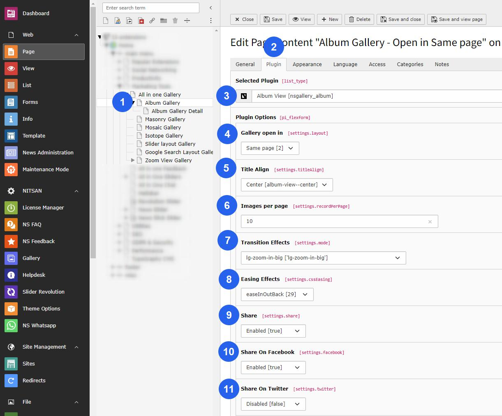
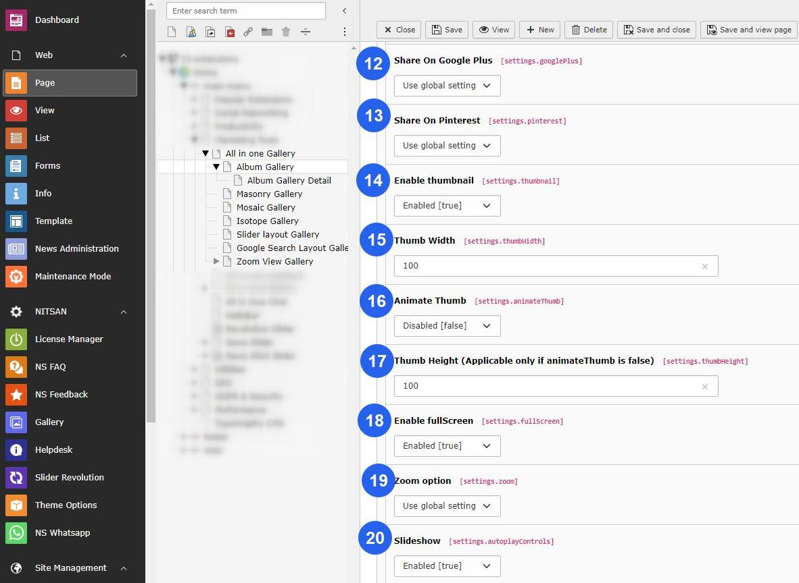
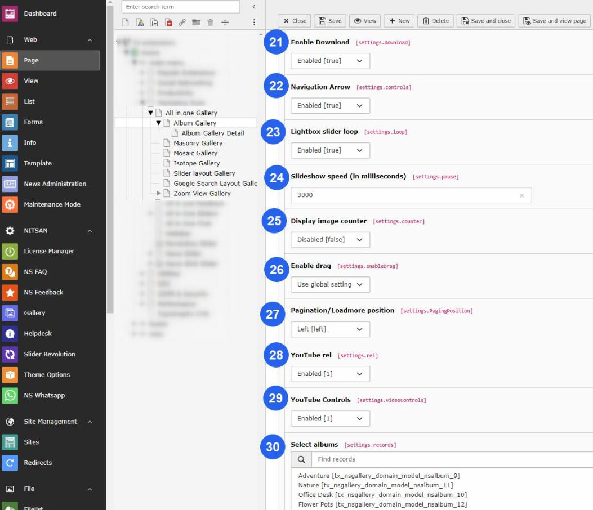
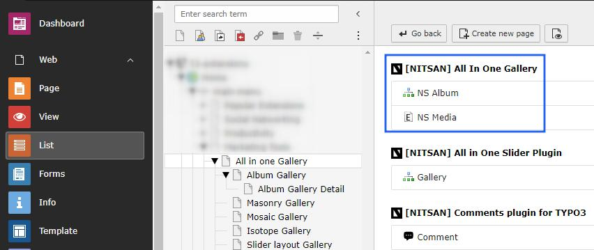

..  include:: /Includes.rst.txt

..  _album-view:

==================
Album View Gallery
==================

Setup album view gallery module for traditional album layouts that can open in the same page or detail page.

Once you add the plugin, switch to the Plugin tab to configure the gallery. Here, you can set gallery-specific configuration.

..  figure:: ../Images/add_gallery_plugin.jpeg
    :alt: Add Gallery plugin

Configuration Options
======================

After setting up the album view plugin, you can see two options to open album view gallery either on the same page OR on detail page. Setup the gallery according to your website needs.

Display Settings
================

**Layout Options:**
- **Title Align** - Setup alignment of the title in center/left alignment
- **Images per page** - Insert the number of images you want to display on your gallery page
- **Pagination/Load more Position** - Setup left/center alignment of pagination/loadmore position

**Visual Effects:**
- **Transition Effect** - Different types of transitions effect will present the progresses from one slide to the next
- **Easing Effect** - You may apply different types of easing effect on the gallery images

Lightbox Configuration
======================

**Thumbnail Settings:**
- **Enable Thumbnail** - You can setup Enable/Disable OR according to the global settings
- **Thumb Width** - Insert the width of thumbnails of the gallery image
- **Thumb Height** - Set thumbnail's height, applicable only if animateThumb is disabled
- **Animate Thumb** - If you need to animate the thumb then enable it otherwise disable OR setup according to the global settings

**Display Features:**
- **Enable Full Screen** - Enable this option if you want to display image in full screen
- **Zoom options** - You can enable/disable the zoom option of image
- **Display Image Counter** - This will display the image counter on the gallery image if enabled
- **Navigation Arrows** - This will hide/unhide the navigation arrows of gallery image

**Interactive Options:**
- **Share** - Social sharing apps like Facebook, Twitter, & Pinterest option will be displayed
- **Enable Download** - This will allow users to download the image
- **Mouse Dragging** - This option facilitates users to change the image by mouse dragging

Slideshow Settings
==================

- **Slide Show** - Enable this option for slide show of the image gallery
- **Slideshow speed** - Insert the speed of the slide show in milliseconds
- **Lightbox Slider Loop** - This option will enable/disable the loop on slider view

Video Configuration
===================

**YouTube Settings:**
- **Youtube rel** - Indicates whether the player should show related videos when playback ends
- **Youtube Controls** - Hide/Show the YouTube controls

Album Selection
===============

Finally, choose the storage folder where you have stored the images for your gallery.

