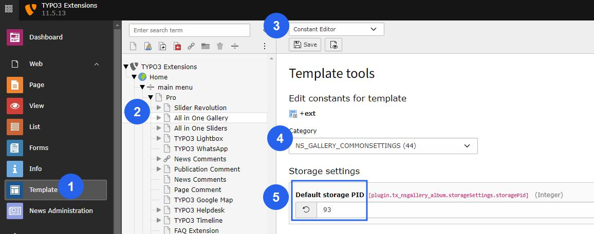
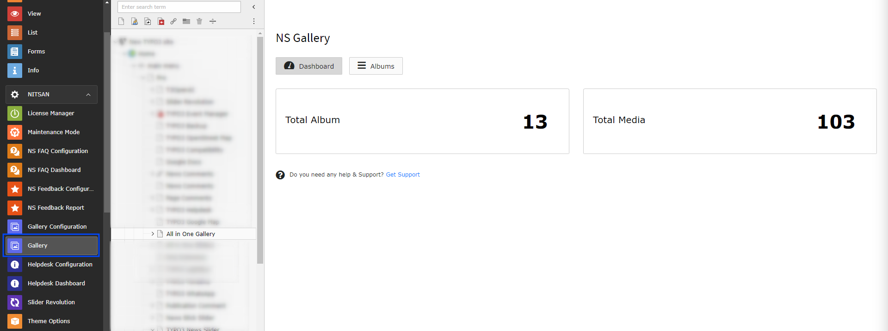
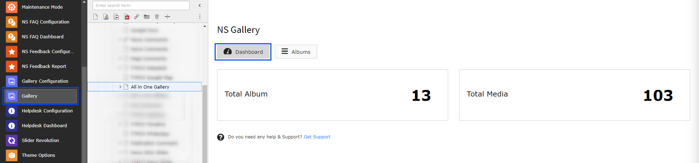
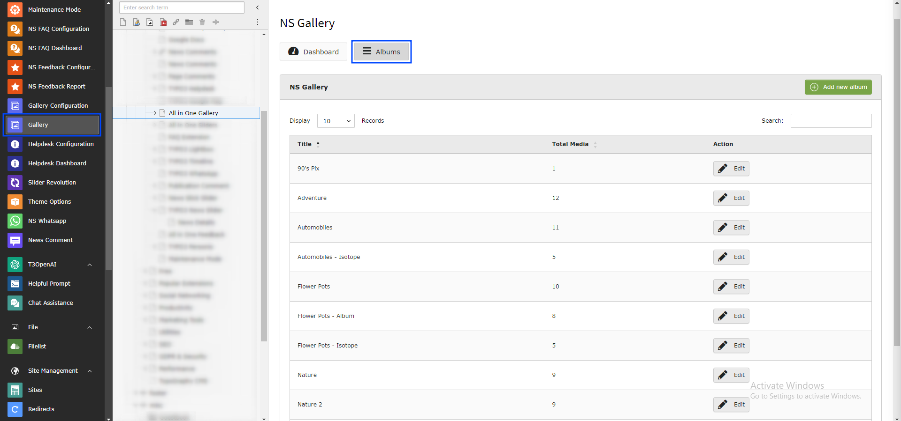
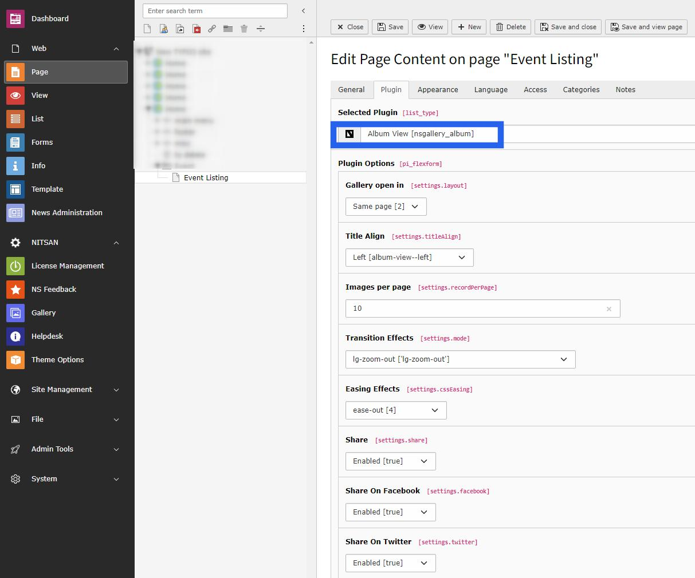
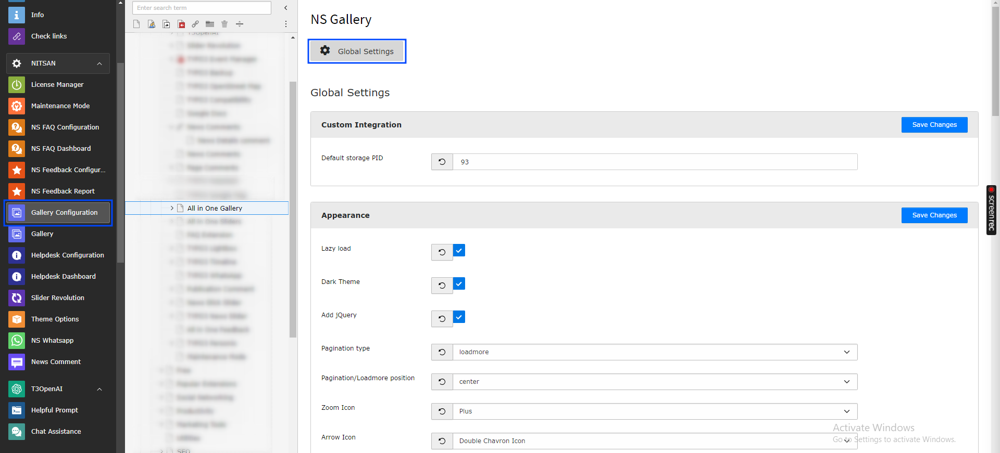

..  include:: /Includes.rst.txt

..  _backend-module:

======================
Gallery Backend Module
======================

..  attention::

    After activation of the gallery extension you must define the storage folder page id from the constant editor. Refer to the image below!

Once you perform the installation process successfully, you will find new backend modules "Gallery and Gallery Configuration" under the "Nitsan" group in the sidebar. These modules will be used for all the configuration of all galleries in your site. These modules provide complete management of galleries.

This module contains various tabs for all kinds of gallery configurations. Let's understand how each tab works one by one.

Dashboard
=========

This is the first tab in the NS Gallery module and, as the name suggests, it shows the dashboard of the complete module. It highlights the total number of albums created on the currently selected page. It also displays how many images/media are created and used in various albums.

Albums Management
=================

This tab allows administrators to create albums. Albums are collections of media (images & videos). Users can add and edit albums from this tab.

To add a new album, click on the "Add new album" button. It will open an album record where you can add media to the album. You can set the album title and add all images/videos as individual media in the album record.

Once an album is created, you just need to select the album in the gallery plugin.

Gallery Configuration
=====================

Global Settings
---------------

This module is used to configure global settings for the gallery extension. Here you can set configuration for the appearance of the gallery, what to show in the lightbox, and also settings for slider, carousel & YouTube videos related settings.

Key Features
============

*   **Dashboard Overview** - Complete statistics of albums and media
*   **Album Management** - Create and manage media collections
*   **Global Settings** - Configure appearance and behavior
*   **Storage Configuration** - Define storage folder locations
*   **Media Support** - Images, videos, YouTube, and Vimeo content
