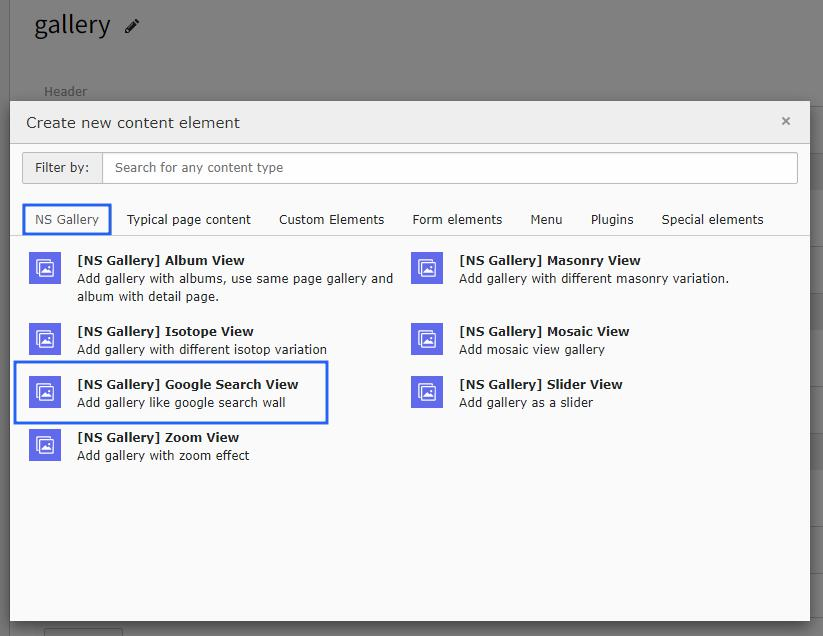
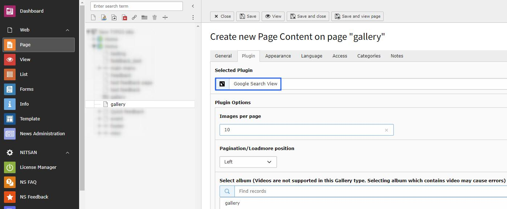

..  include:: /Includes.rst.txt

..  _google-search-view:

==================
Google Search View
==================

Setup Google search view galleries to display images from Google search results integration.

Once you add the plugin, you can configure Google search integration to display external images.

Features
========

*   **Google Integration** - Search and display Google images
*   **External Content** - No need to upload images manually
*   **Search Keywords** - Configure search terms
*   **Automatic Updates** - Fresh content from search results
*   **Lightbox Support** - View images in lightbox

Configuration
=============

**Search Settings:**
- Configure search keywords
- Set number of results to display
- Define safe search settings
- Set up refresh intervals

**Display Options:**
- Grid layout configuration
- Image sizing options
- Lightbox integration
- Responsive design settings

..  note::

    This feature requires proper Google API configuration and may have usage limitations based on Google's terms of service.
