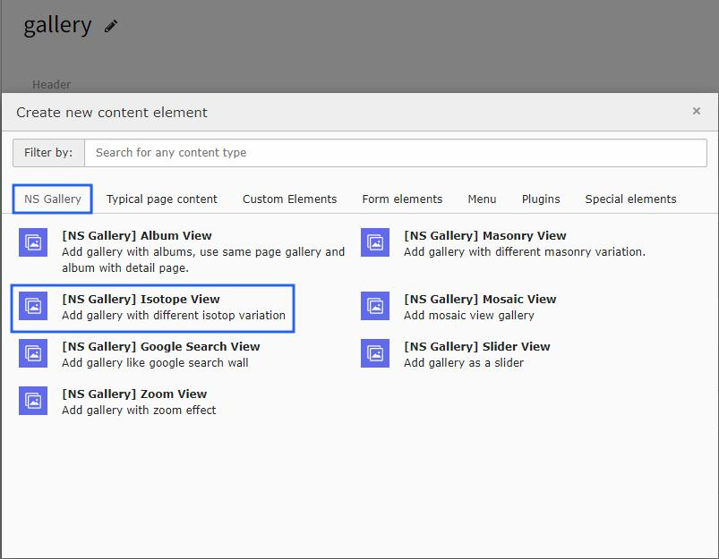
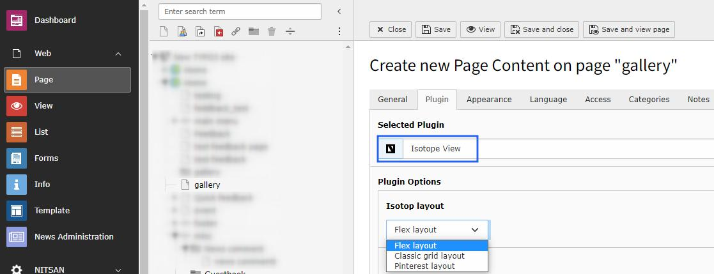

..  include:: /Includes.rst.txt

..  _isotope-view:

===============
Isotope Gallery
===============

Advanced gallery with filtering and sorting capabilities, allowing users to organize content by categories or criteria.

Once you add the plugin, switch to the Plugin tab to configure the gallery. Here, you can set gallery-specific configuration and isotope filtering options.

Features
========

*   **Filtering System** - Filter content by categories
*   **Sorting Options** - Sort by various criteria
*   **Animated Transitions** - Smooth filtering animations
*   **Responsive Layout** - Works on all devices
*   **Lightbox Integration** - Full lightbox support

Configuration
=============

..  note::

    All the configuration options will be the same as Album view gallery with additional filtering and sorting options.
