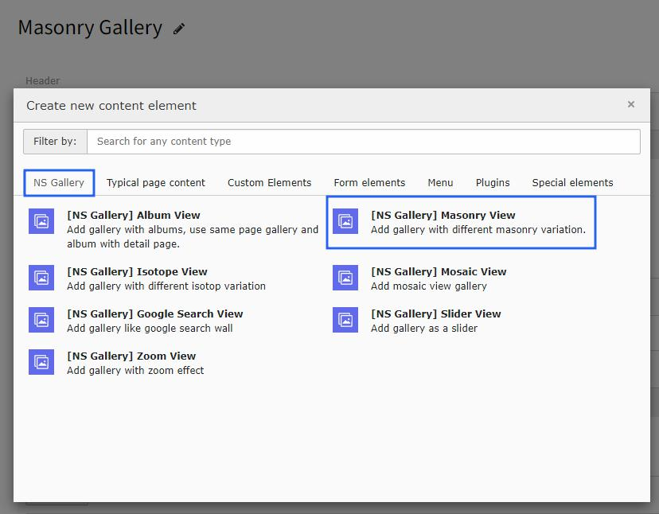
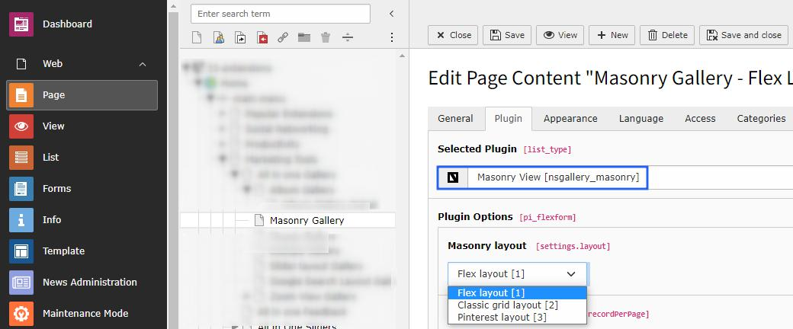

..  include:: /Includes.rst.txt

..  _masonry-view:

===============
Masonry Gallery
===============

Once you setup the masonry view in the masonry tab of the Gallery module, you can use them in gallery plugins to display on your site with dynamic grid arrangements.

Once you add the plugin, switch to the Plugin tab to configure the gallery. Here, you can set gallery-specific configuration, lightbox-related configuration and masonry layout to display in this gallery.

Layout Types
============

Masonry view plugin has 3 types of layout:

**1. Flex Layout**
Modern flexible layout that adapts to content

**2. Classic Grid Layout**
Traditional grid-based arrangement

**3. Pinterest Layout**
Pinterest-style masonry arrangement

You can setup according to your website needs.

Configuration
=============

..  note::

    All the configuration options will be the same as Album view gallery and are self-explanatory.

Features
========

*   **Responsive Design** - Adapts to different screen sizes
*   **Dynamic Grid** - Automatically arranges items based on content
*   **Multiple Layouts** - Choose from flex, classic, or Pinterest styles
*   **Lightbox Integration** - Full lightbox support with all features
*   **Performance Optimized** - Efficient rendering for large galleries
