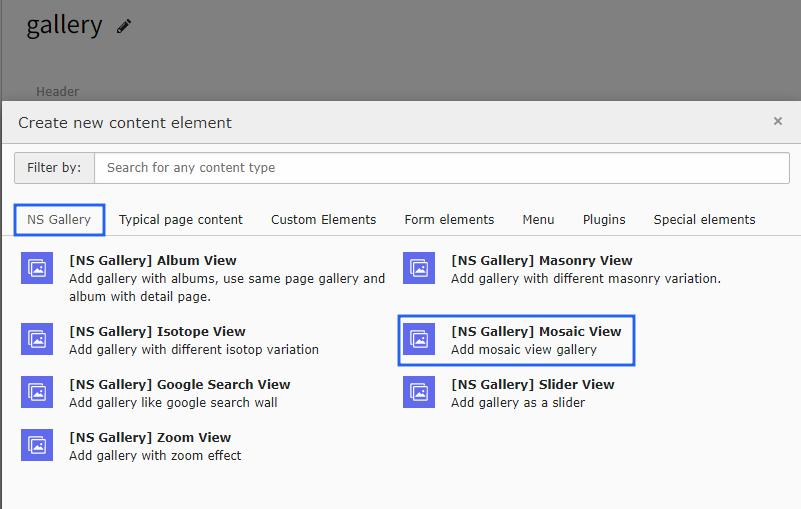

..  include:: /Includes.rst.txt

..  _mosaic-view:

==============
Mosaic Gallery
==============

Create stunning mosaic layouts with tile-based arrangements for modern visual presentations.

Once you add the plugin, switch to the Plugin tab to configure the gallery. Here, you can set gallery-specific configuration and mosaic layout options.

..  figure:: ../Images/ns_gallery_mosiac_view.jpeg
    :alt: Add Mosaic Plugin

Features
========

*   **Tile-based Layout** - Modern mosaic arrangement
*   **Responsive Design** - Adapts to all screen sizes
*   **Lightbox Integration** - Full lightbox support
*   **Custom Spacing** - Configurable tile spacing
*   **Performance Optimized** - Efficient for large galleries

Configuration
=============

..  note::

    All the configuration options will be the same as Album view gallery and are self-explanatory.
