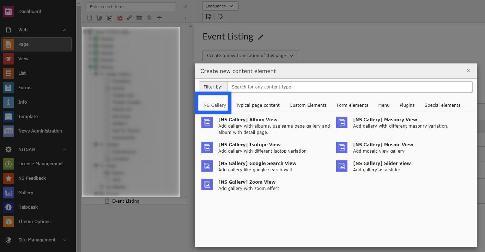
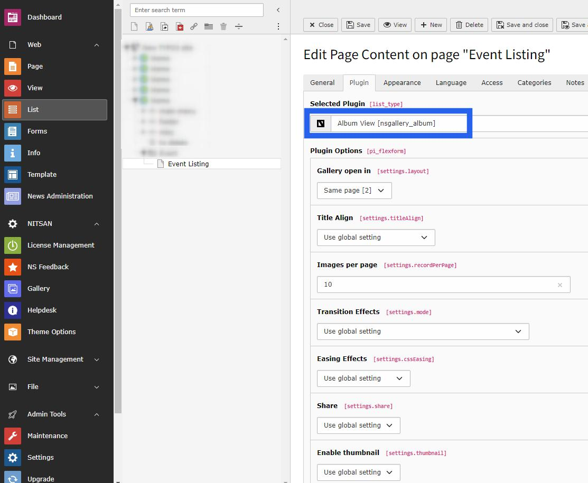

..  include:: /Includes.rst.txt

..  _setup-gallery:

==========================================
How to Setup & Display Gallery at Website
==========================================

Once you setup the albums in the Albums tab of the Gallery module, you can use them in gallery plugins to display on your site. You will find a plugin for each gallery type in the Create New Content Element wizard. Select the appropriate gallery plugin from the wizard.

Plugin Configuration
=====================

Once you add the plugin, switch to the Plugin tab to configure the gallery. Here, you can set gallery-specific configuration, lightbox-related configuration, and albums to display in this gallery.

Lightbox Configuration
======================

If the gallery plugin you have selected supports lightbox, then you can configure the following settings in the plugin:

**Display Settings:**
- Transition Effect
- Easing Effect
- Thumbnail
- Full Screen
- Image Counter

**Interactive Features:**
- Sharing button
- Zoom option
- Navigation Arrows
- Mouse Dragging
- Download option

**Slideshow Settings:**
- Slide Show
- Slideshow speed

Setup Process
=============

1. **Create Albums** - Use the backend module to create albums with media
2. **Select Plugin** - Choose the appropriate gallery type from the content wizard
3. **Configure Settings** - Set up gallery-specific and lightbox options
4. **Select Albums** - Choose which albums to display in the gallery
5. **Save and Preview** - Save your configuration and preview the result

Gallery Types Available
=======================

Each gallery type has its own plugin in the content element wizard:

- **Album View** - Traditional album layouts
- **Masonry View** - Dynamic masonry grids
- **Mosaic View** - Tile-based layouts
- **Isotope View** - Filterable and sortable galleries
- **Slider View** - Carousel and slider presentations
- **Google Search View** - Google image search integration
- **Zoom View** - Enhanced zoom functionality

Best Practices
===============

*   **Image Optimization** - Use optimized images for better performance
*   **Album Organization** - Create logical album structures
*   **Responsive Design** - Test galleries on different devices
*   **SEO Considerations** - Use descriptive alt texts and titles
*   **Loading Performance** - Consider lazy loading for large galleries
