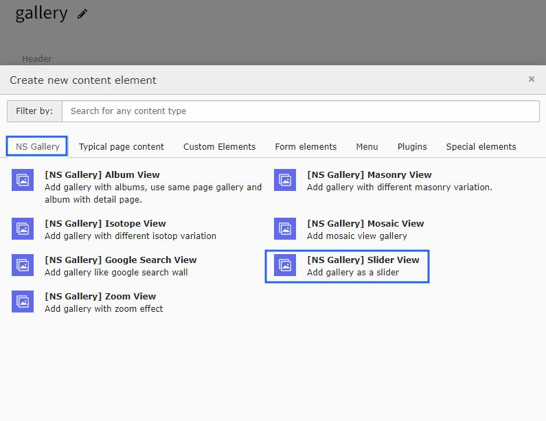
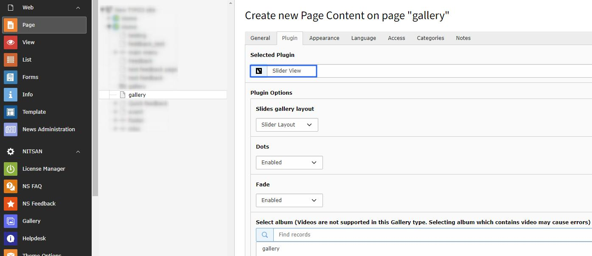
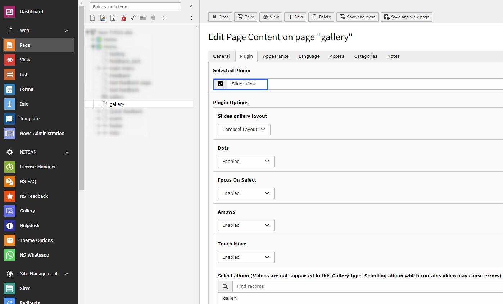

..  include:: /Includes.rst.txt

..  _slider-view:

=======================
Slider & Carousel View
=======================

Create slider and carousel view galleries with navigation controls and smooth transitions.

Configuration Options
======================

You can configure both slider and carousel views:

Features
========

**Slider View:**
*   **Full-width Display** - Showcase images in full width
*   **Navigation Controls** - Previous/next arrows
*   **Autoplay Options** - Automatic slideshow
*   **Touch Support** - Swipe gestures on mobile

**Carousel View:**
*   **Multiple Items** - Show multiple images at once
*   **Responsive Breakpoints** - Different item counts per screen size
*   **Infinite Loop** - Continuous scrolling
*   **Center Mode** - Center active item

Configuration
=============

..  note::

    All the configuration options will be the same as Album view gallery with additional slider-specific settings for timing, transitions, and navigation.
