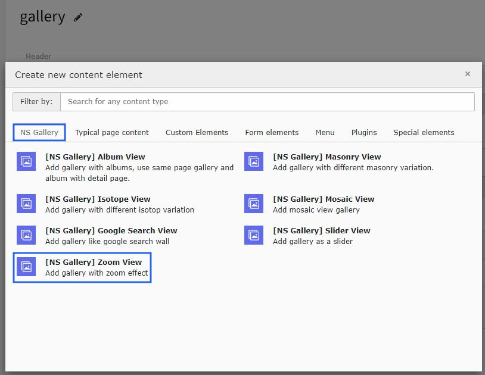
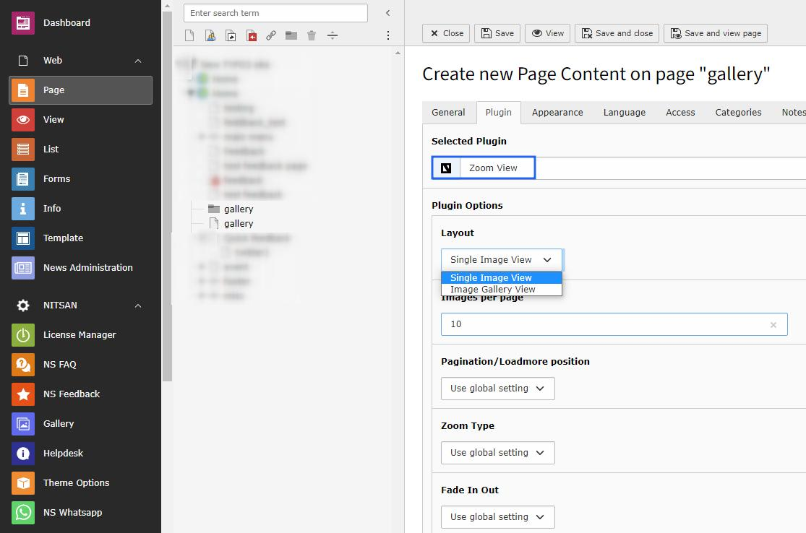

..  include:: /Includes.rst.txt

..  _zoom-view:

=========
Zoom View
=========

Configure zoom view galleries with magnification features and detailed image viewing capabilities.

Enhanced viewing experience with zoom functionality for detailed image inspection.

Features
========

*   **Magnification** - Detailed image inspection
*   **Mouse Interaction** - Zoom with mouse hover/click
*   **Touch Support** - Pinch to zoom on mobile devices
*   **Smooth Transitions** - Fluid zoom animations
*   **High Resolution** - Support for high-quality images

Zoom Options
============

**Interaction Methods:**
- Mouse hover zoom
- Click to zoom
- Touch/pinch to zoom (mobile)
- Keyboard shortcuts

**Display Settings:**
- Zoom level configuration
- Transition speed
- Zoom indicator
- Full-screen zoom mode

**Image Quality:**
- High-resolution image support
- Progressive loading
- Optimized performance
- Responsive sizing

Configuration
=============

..  note::

    All the configuration options will be the same as Album view gallery with additional zoom-specific settings for magnification levels and interaction methods.
